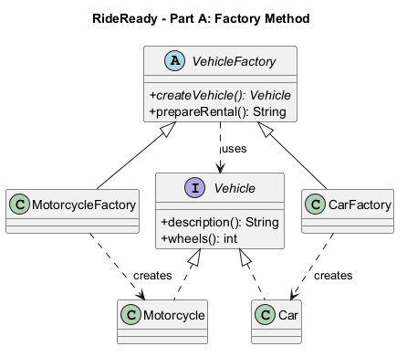
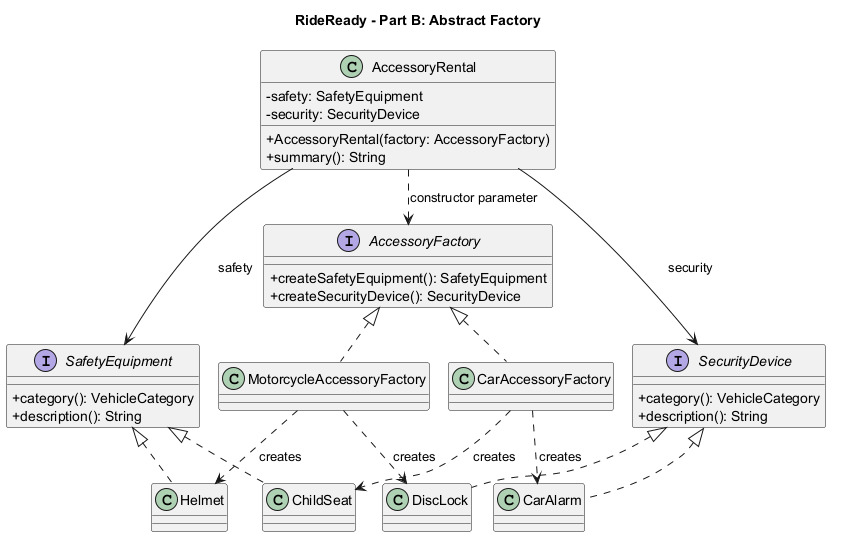

# RideReady: Factory Method and Abstract Factory
Assignment 2 | ShP-2216 — Software Design Patterns | Astana IT University

Student: [enter your full name]

Group: [enter your group]

Repository: https://github.com/Ziyadin23/vehicle-factory-assignment

## 1. Introduction
RideReady is a Java 17 console demonstration of a vehicle rental service (Option B). It handles two categories: motorcycles and cars. Part A creates one vehicle; Part B creates a compatible pair of accessories for that category. A motorcycle receives a helmet and a disc lock. A car receives a child seat and a car alarm. These are simplified example packages, not claims about legally required or universally suitable equipment.

Factory Method fits Part A because a shared rental preparation workflow needs a Vehicle but should not decide which concrete vehicle to construct. Subclasses make that decision. Abstract Factory fits Part B because two different product types, SafetyEquipment and SecurityDevice, must be created as a consistent family. Switching the injected factory changes the whole family.

## 2. Part A — Factory Method
Vehicle is the Product interface. Motorcycle and Car are Concrete Products. VehicleFactory is the abstract Creator, and createVehicle() is its factory method. MotorcycleFactory and CarFactory are Concrete Creators.

VehicleFactory.prepareRental() invokes createVehicle() and then uses only Vehicle.description() and Vehicle.wheels(). Runtime dispatch selects the subclass implementation. This is a genuine Factory Method: creation is delegated to subclasses, rather than centralized in a static method containing a type-selection switch.



Figure 1. Dashed lines with hollow triangles mean interface realization; solid lines with hollow triangles mean inheritance; dashed open arrows mean dependency. “creates” marks concrete construction dependencies. Source: factory-method.puml.

Execution: Main supplies a MotorcycleFactory; prepareRental() calls its overridden factory method; a Motorcycle is returned through Vehicle; the inherited workflow formats the result. The CarFactory follows the same workflow.

## 3. Part B — Abstract Factory
AccessoryFactory declares createSafetyEquipment() and createSecurityDevice(). SafetyEquipment and SecurityDevice are Abstract Products. MotorcycleAccessoryFactory creates Helmet and DiscLock; CarAccessoryFactory creates ChildSeat and CarAlarm. Both factories return interfaces.

AccessoryRental is the pattern Client. Its constructor accepts AccessoryFactory and stores only SafetyEquipment and SecurityDevice references. It has no imports of concrete factories or concrete products and never constructs them. Main is the composition root: it selects concrete factories and passes them into the reusable client.



Figure 2. Concrete products realize their corresponding product interface; concrete factories realize AccessoryFactory. Factory dependencies show which products they create. The client's solid arrows represent stored product references and its dashed arrow represents the factory constructor dependency. Source: abstract-factory.puml. VehicleCategory is a shared enum referenced by category(), omitted as a separate box for readability.

An injected factory normally guarantees consistency. AccessoryRental additionally rejects null products and mismatched family identifiers. This equality check is an invariant check, not a switch that chooses a concrete product. The constructor centralizes validation so concrete factories do not duplicate assembly logic.

## 4. Clean Code principles with annotated excerpts
### 4.1 Meaningful names and explicit roles
```java
public abstract class VehicleFactory {
    public abstract Vehicle createVehicle();
}
```
Vehicle names the product; VehicleFactory names the creator; createVehicle states the operation and return role. MotorcycleAccessoryFactory names both the family and the responsibility, avoiding ambiguous names such as Manager or Helper.

### 4.2 Polymorphism replaces product-selection conditionals
```java
Vehicle vehicle = createVehicle();
return "Ready: " + vehicle.description() + " (" + vehicle.wheels() + " wheels)";
```
This excerpt from VehicleFactory.prepareRental() works for any Vehicle implementation. There is no instanceof check or category switch. The test suite injects an additional bicycle creator to demonstrate reuse of this unchanged workflow.

### 4.3 Small, single-purpose factory methods
```java
@Override
public Vehicle createVehicle() {
    return new Motorcycle();
}
```
MotorcycleFactory.createVehicle() performs one construction and returns the product abstraction. It does not print output, read input, or assemble accessory families.

### 4.4 Depend on abstractions and hide implementation details
```java
private final SafetyEquipment safety;
private final SecurityDevice security;
public AccessoryRental(AccessoryFactory factory) {
    // Products are obtained through the factory interface.
}
```
These fields and the constructor signature are from AccessoryRental; the body is abbreviated here. Private final references hide internal representation. No public setters or concrete-product dependencies are exposed. This reflects the object/data distinction and encapsulation discussion in Clean Code, Chapter 6; it is not merely replacing public fields with getters.

### 4.5 Validate construction once and fail early
```java
Objects.requireNonNull(factory, "Accessory factory is required");
safety = Objects.requireNonNull(factory.createSafetyEquipment(), "Safety equipment is required");
security = Objects.requireNonNull(factory.createSecurityDevice(), "Security device is required");
if (safety.category() != security.category()) {
    throw new IllegalArgumentException("Accessories must belong to the same vehicle family");
}
```
The AccessoryRental constructor establishes its invariant before use. Bad factories fail immediately with clear messages. Neither concrete factory duplicates this validation. The tests cover null factory, null safety equipment, null security device, and mixed families.

### 4.6 Separate composition, domain work, and presentation
```java
demonstrate("Car rental", new CarFactory(), new CarAccessoryFactory());
```
Main wires the application. Factories construct products, VehicleFactory handles the shared rental workflow, and AccessoryRental works with the accessory interfaces. Console output is isolated in Main. Concrete selection at the composition root is expected dependency wiring, not concrete construction inside the Abstract Factory client.

## 5. Validation and demonstration
Run ./run.ps1 for the console demo and ./run.ps1 -Mode test for the behavioral checks. Both scripts compile all sources with --release 17, -Xlint:all and -Werror. The test runner uses explicit AssertionError checks; it does not depend on Java assertions being enabled.

Expected demo:
```text
RideReady | Factory Method & Abstract Factory

Motorcycle rental
  Part A - Ready: Motorcycle (2 wheels)
  Part B - Motorcycle helmet + Motorcycle disc lock

Car rental
  Part A - Ready: Car (4 wheels)
  Part B - Car child seat + Car alarm
```

The 16 behavioral checks cover both vehicle contracts, shared workflows, each factory's family identifiers, client output, invalid construction, a new creator using the unchanged workflow, and substitution of a custom safety product. All 16 checks passed on Temurin JDK 17.0.20.1 on Windows. Actual execution logs are stored in docs/demo-output.txt and docs/test-output.txt after verification.

## 6. Tradeoffs and limitations
The examples intentionally model a small teaching problem. Direct constructors would be shorter for a fixed application; the patterns become useful when creation varies independently of client behavior.

Adding another vehicle type requires a Vehicle implementation and VehicleFactory subclass. Adding a new accessory family requires implementations of both product interfaces and a new AccessoryFactory implementation; the client remains unchanged. The VehicleCategory enum must also be extended, so the model is not completely closed to modification.

Adding a third accessory product type requires extending AccessoryFactory and all concrete factories. This is the key Abstract Factory tradeoff: new families are easy; new product kinds affect every family.

The accessory invariant checks consistency within a pair. It does not automatically prove that an independently supplied VehicleFactory matches an AccessoryFactory; Main explicitly wires matching pairs. Real rental systems would also need customer details, persistence, suitability rules, and broader validation. No physical safety certification is implied.

## 7. Conclusion
Choose Factory Method when a workflow needs one product abstraction and subclasses should choose its concrete implementation. Choose Abstract Factory when a client needs several related product types that must be supplied together in a compatible family. RideReady demonstrates both without a central type-selection switch: Part A delegates vehicle creation to subclasses; Part B delegates accessory-family creation to an injected factory.

## 8. References and authorship
- Assignment 2 — Factory Method & Abstract Factory, supplied course instructions.
- Freeman, E., and Robson, E. Head First Design Patterns, Chapter 4 (assigned course reference).
- Martin, R. C. Clean Code (2008), Chapter 6 (assigned course reference).
- The course's Lecture 2 and Moodle reading should be reviewed before the defense; those materials were not supplied here.

Preparation disclosure: this project and report were developed with AI assistance. Review, adapt, and disclose assistance as required by the course. Student identity must be filled in by the student; this draft does not claim unaided authorship.
